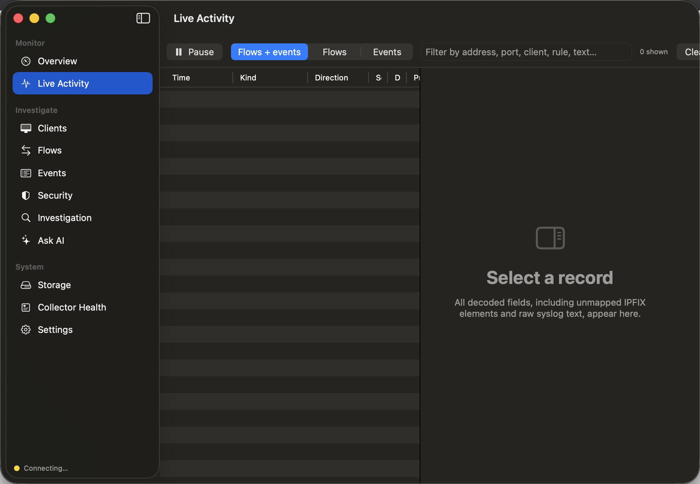
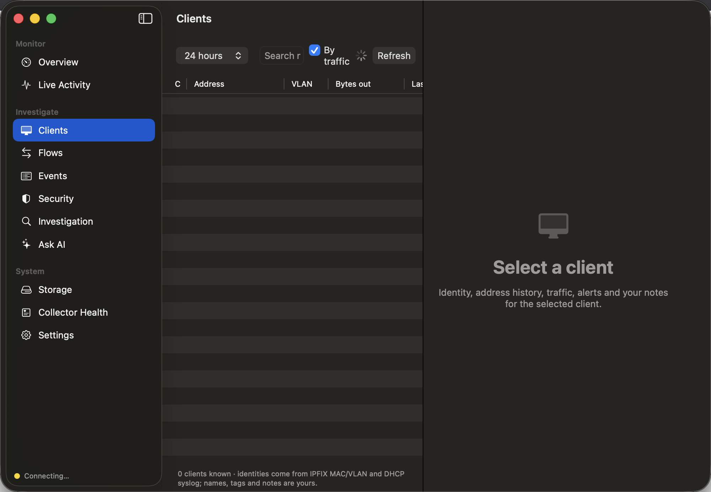
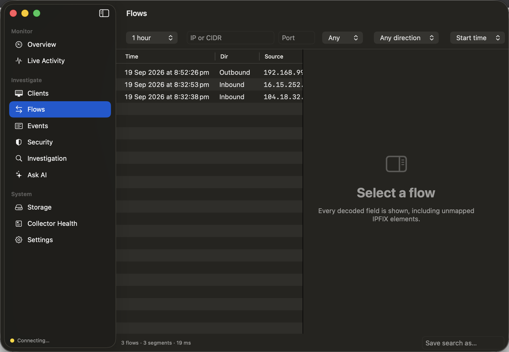
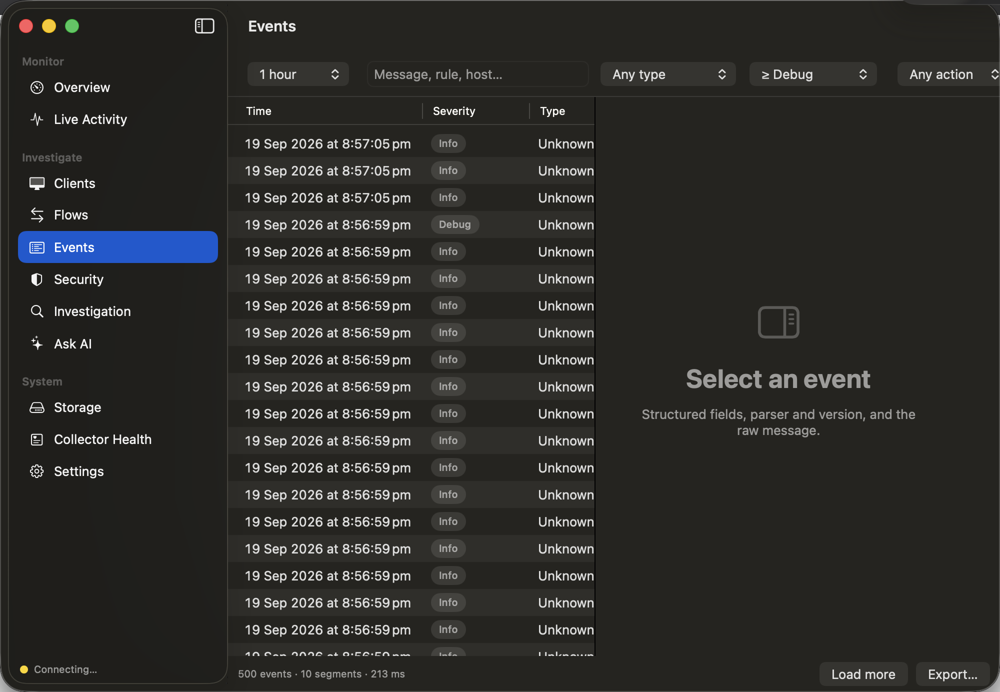
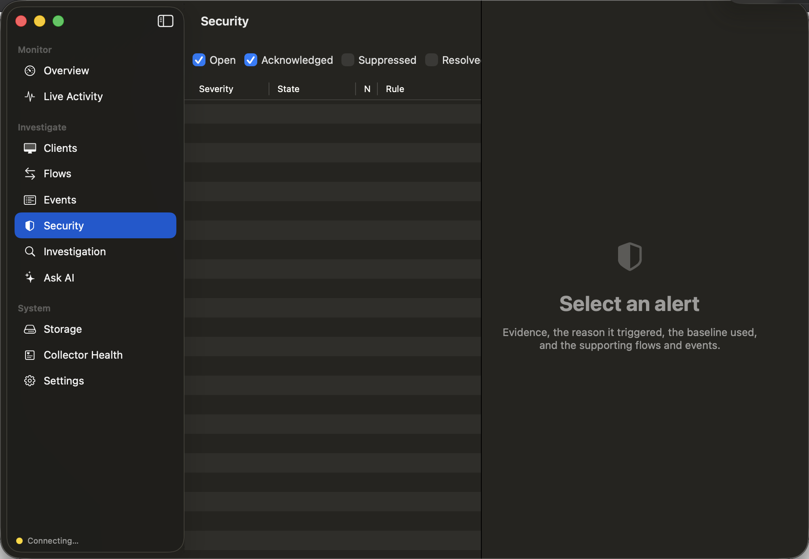
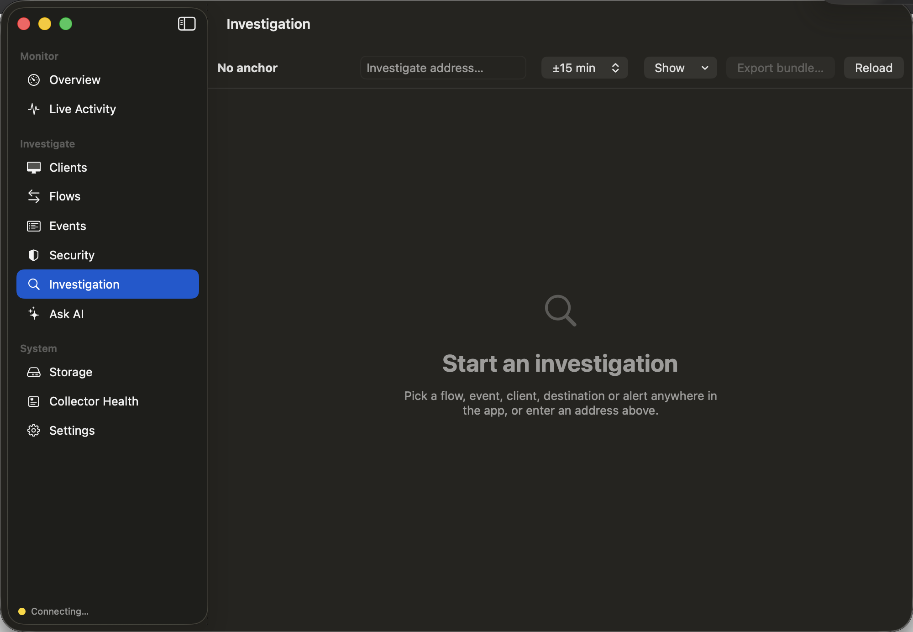
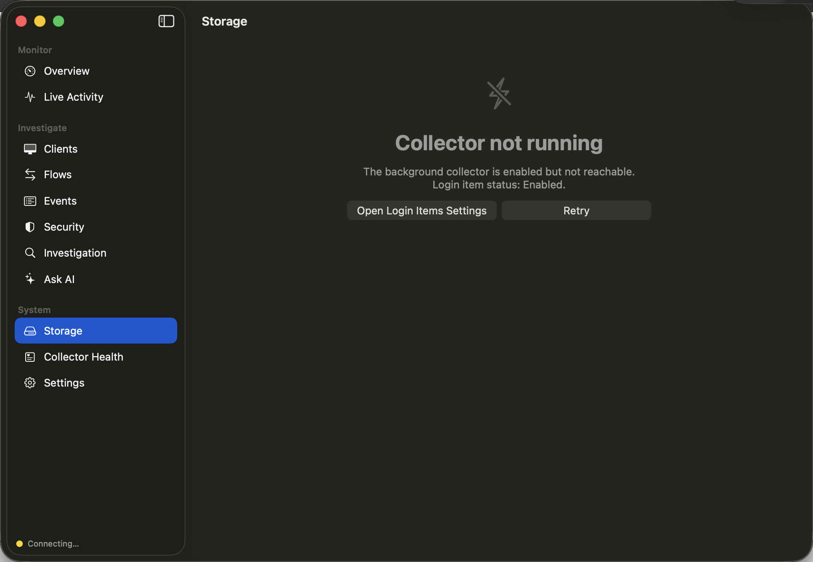
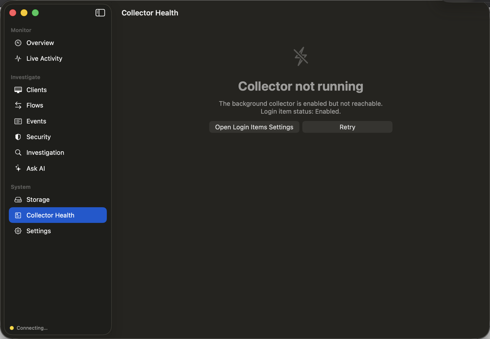
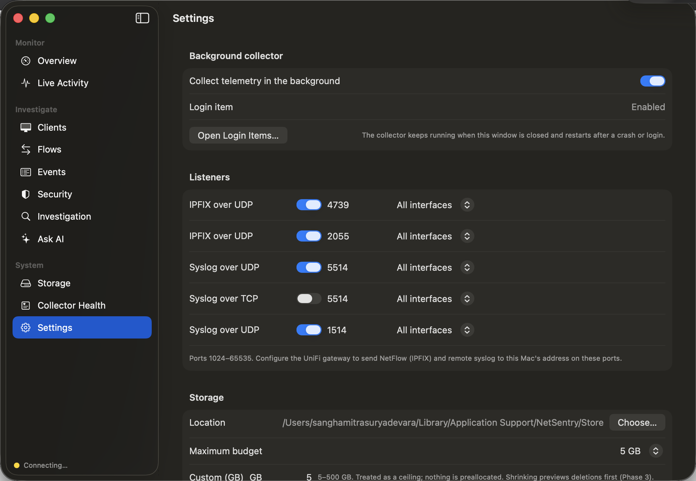
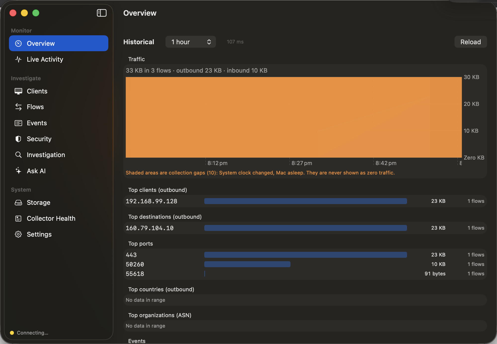

# NetSentry

**Privacy-first local network observability and security analytics for macOS.**

NetSentry turns a Mac into a network monitor for your home or small-office network. It receives
**IPFIX / NetFlow v10** flow records and **syslog** events from a UniFi gateway, stores them locally
within a bounded disk budget, and gives you investigation, correlation, explainable detections, and a
built-in **Ask AI** assistant — all on-device. **No cloud, no account, no telemetry leaves your Mac.**

> Verified against a **UniFi Cloud Gateway Fiber (UCG Fiber)**. Requires macOS 15 (Sequoia) or later.


---

## Table of contents

- [Highlights](#highlights)
- [Screenshots](#screenshots)
- [How it works](#how-it-works)
- [System requirements](#system-requirements)
- [Install (download the DMG)](#install-download-the-dmg)
- [Set up your UniFi gateway](#set-up-your-unifi-gateway)
- [Ask AI](#ask-ai)
- [Build from source](#build-from-source)
- [Releases & versioning](#releases--versioning)
- [Limitations](#limitations)
- [Documentation](#documentation)
- [Privacy](#privacy)

---

## Highlights

- **Flow collection** — IPFIX v10 (NetFlow v10) decoder with template/options handling, variable-length and
  enterprise fields, multi-exporter/multi-domain support, template refresh/withdraw/expiry, sequence-based
  loss detection, restart & clock-skew detection, and PSAMP sampling. Sampled counts are shown with a
  `sampled ×N` badge and never silently scaled.
- **Syslog ingestion** — RFC 3164 / RFC 5424 parsing with RFC 6587 TCP framing and family parsers
  (netfilter, dnsmasq DHCP/DNS, OpenSSH, Suricata) behind a versioned registry, with verbatim fallback for
  unmatched lines.
- **Local columnar storage** — DuckDB → Parquet segments (ZSTD, SHA-256 verified), minute/hour/day rollups,
  a hot in-memory ring buffer, and **budget-based retention** that survives a hard crash. ~30 bytes/flow.
- **Analytics dashboard** — traffic over time (with collection gaps shaded, never faked as zero), top
  clients / destinations / ports / countries / organizations, filterable Flows and Events tables with saved
  searches and CSV export.
- **Client identity** — MAC / DHCP-hostname learning, address history, merge/split, trust levels, tags and
  notes; GeoIP / ASN enrichment from a user-supplied MaxMind database.
- **Explainable detection** — 15 deterministic, local rules (first-seen destination/country/ASN/service,
  unauthorized resolver, horizontal/vertical scan, repeated denials, large transfer, unusual volume vs a
  14-day p95, unusual hour, beaconing, IDS-correlated, and more), each with editable parameters and a full
  alert workflow (states, dedupe, suppressions, expectations, notes) plus native notifications.
- **Investigation timeline** — correlates flows, events, alerts, annotations and gaps into one timeline
  (observational relations only, never causal claims).
- **Ask AI** — an in-app assistant that answers plain-language questions about your network, grounded in
  your live local telemetry. Works with any OpenAI-compatible or Anthropic-compatible endpoint. See
  [Ask AI](#ask-ai).
- **Exports** — CSV/JSON, Markdown incident reports and investigation bundles, with optional redaction
  (salted SHA-256 tokens).

## Screenshots

| Overview | Live Activity |
|---|---|
|  |  |

| Clients | Flows |
|---|---|
|  |  |

| Events | Security |
|---|---|
|  |  |

| Investigation | Storage |
|---|---|
|  |  |

| Collector Health | Settings |
|---|---|
|  |  |

| Setup Wizard |
|---|
|  |

> Screenshots are captured automatically from the running app by the `ScreenshotTests` UI test.

## How it works

NetSentry is **two cooperating processes**, both un-sandboxed with the hardened runtime
(see [`docs/adr/ADR-002-sandboxing.md`](docs/adr/ADR-002-sandboxing.md) for why):

1. **NetSentry.app** — the SwiftUI dashboard you interact with.
2. **NetSentryCollector** — a background LaunchAgent (`LSUIElement`, no dock icon) embedded inside the app
   at `Contents/Library/NetSentryCollector.app`. It is registered with launchd via **`SMAppService`** from
   the app's Settings (the login-item toggle). It runs the pipeline: **receive → decode → enrich → persist →
   detect → live**, while you are logged in (including when the screen is locked).

The two talk over an **XPC** connection (Mach service `com.netsentry.collector.xpc`); each side pins the
other's code signature. The dashboard also reads the local store directly (read-only) for analytics, so
queries never block collection. The engine is built as Swift 6 packages (Core, IPFIX, Syslog, Enrichment,
Persistence, Analytics, Detection, Correlation, Export); DuckDB is the analytical store and SQLite holds
metadata. See [`docs/modules-and-repository.md`](docs/modules-and-repository.md).

## System requirements

- **macOS 15.0 (Sequoia) or later.**
- The prebuilt DMG is a **universal binary** — it runs natively on both Apple Silicon and Intel Macs.
- A **UniFi gateway** that can export IPFIX/NetFlow and remote syslog (verified on the UCG Fiber).
- *Optional:* a MaxMind **GeoLite2 / GeoIP2** database file for country/ASN enrichment (you supply it).

## Install (download the DMG)

1. Go to the [**Releases**](https://github.com/sm-coding-projects/NetSentry/releases) page and download the
   latest `NetSentry-<version>-universal.dmg`.
2. Open the DMG and drag **NetSentry** to **Applications**.
3. **First launch — clear Gatekeeper.** The current builds are ad-hoc signed and **not notarized**, so macOS
   will block the first launch. Do one of:
   - **Right-click** NetSentry in Applications → **Open** → **Open** in the dialog; or
   - run once in Terminal:
     ```bash
     xattr -dr com.apple.quarantine /Applications/NetSentry.app
     ```
4. Launch NetSentry. The **setup wizard** will walk you through enabling the background collector (a
   Login Item — approve it in **System Settings → General → Login Items**) and testing gateway traffic.

> **Why the warning?** A notarized build needs a paid Apple Developer ID certificate. Once one is available,
> tagged releases produce a signed, notarized DMG and this step goes away — see
> [Releases & versioning](#releases--versioning).

## Set up your UniFi gateway

Point your gateway at your Mac's LAN address (reserve it in DHCP or make it static — the setup wizard shows
you the address). Then configure two exports:

### 1. NetFlow / IPFIX

UniFi Network → **Settings › CyberSecure › Traffic Logging › NetFlow**

| Setting | Value |
|---|---|
| Server / destination | Your Mac's LAN IP |
| Port | **2055** (UniFi default; NetSentry also listens on 4739) |
| Version | IPFIX (NetFlow v10) |

The UCG Fiber exports **sampled** flows (observed **1:512**). NetSentry reads the sampling rate from the
options template and shows it per flow — it does not silently multiply byte/packet counts.

### 2. Remote syslog

UniFi Network → **Settings › System › Advanced › Remote Logging** (or **CyberSecure › Traffic Logging ›
Syslog** on newer firmware)

| Setting | Value |
|---|---|
| Server | Your Mac's LAN IP |
| Port | **5514** (UDP) |
| Protocol | UDP (TCP optional — enable the TCP listener in NetSentry Settings) |

> ⚠️ **Do not use port 514.** Ports below 1024 are privileged on macOS and the collector runs as your user,
> so it cannot bind 514. Any port ≥ 1024 works; 5514 is the default. Enable firewall/traffic, IDS/IPS
> (CyberSecure), system, client and device logging, and turn on **Log** for the firewall rules you care about.

### 3. Verify

Open **Collector Health** to see listener state, last-packet time and template count, and **Live Activity**
to watch decoded flows arrive within seconds. The setup wizard automates these checks.

Full details, including firmware-specific menu paths, are in
[`docs/unifi-configuration.md`](docs/unifi-configuration.md).

## Ask AI

The **Ask AI** tab is an in-app chat assistant that answers questions like *"Is anything wrong with my
network right now?"* or *"Which devices used the most bandwidth in the last hour?"* It runs read-only tools
against your **live local telemetry** (`get_network_overview`, `query_flows`, `top_talkers`, `list_clients`,
`list_alerts`, `bandwidth_time_series`) in an agentic loop and is instructed to base every claim on that
data — it cannot change any settings.

- **Bring your own model.** Choose an **OpenAI-compatible** or **Anthropic-compatible** provider. The base
  URL, model id and temperature are all configurable, so you can point it at a hosted API **or a local /
  self-hosted OpenAI-compatible endpoint**.
- **Your key stays in the Keychain.** The API key is stored in the macOS Keychain (service `NetSentry.AI`),
  never in preferences or in this repository. Non-secret settings live in `UserDefaults`.

Configure it under **Settings → Ask AI**.

## Build from source

Prerequisites: **macOS 15+**, **Xcode 26.x**, and **XcodeGen** (`brew install xcodegen`). No Apple Developer
account is needed for a local (ad-hoc signed) build.

```bash
# Generate the Xcode project from project.yml
./Scripts/generate-project.sh

# Run the test suite (DuckDB compiles from source the first time — this can take several minutes)
swift test

# Build and run the app
xcodebuild -project NetSentry.xcodeproj -scheme NetSentry build
```

Build an installable, ad-hoc-signed DMG locally (no certificate required):

```bash
Scripts/build-release.sh --adhoc --version 0.1.0 --build 1
# -> build/release/NetSentry-0.1.0-universal.dmg (+ .sha256)
```

See [`docs/developer-setup.md`](docs/developer-setup.md) for build gotchas and
[`docs/release.md`](docs/release.md) for the full signed/notarized release process.

## Releases & versioning

- Versioned DMGs are published on the [**Releases**](https://github.com/sm-coding-projects/NetSentry/releases)
  page, each with a `.sha256` checksum. The app version comes from `MARKETING_VERSION` in `project.yml`.
- Pushing a **`v*` tag** (e.g. `v0.1.0`) triggers the
  [`release`](.github/workflows/release.yml) GitHub Actions workflow, which builds the app on an Apple Silicon
  runner, packages the DMG, and creates the GitHub Release automatically:
  ```bash
  # after bumping MARKETING_VERSION in project.yml
  git tag v0.1.0 && git push origin v0.1.0
  ```
- **Notarized releases:** CI produces an ad-hoc DMG so it works without a certificate. To ship a signed,
  notarized build, run `Scripts/build-release.sh --team-id … --identity … --notary-profile …` on a machine
  with a Developer ID certificate (or extend the [workflow](.github/workflows/release.yml) to import one) —
  see [`docs/release.md`](docs/release.md).
- Changes are tracked in [`CHANGELOG.md`](CHANGELOG.md).

## Limitations

NetSentry is **v0.1.0**. Known limitations (full list in
[`docs/known-limitations.md`](docs/known-limitations.md)):

- Only the **UniFi UCG Fiber** has been exercised. No IPFIX over TCP/SCTP, and no NetFlow v5/v9 or sFlow.
- Per-user LaunchAgent only: collection runs while you are logged in and pauses while the Mac sleeps
  (gaps are recorded and shown, never faked as zero).
- Detection is fully local and deterministic — no threat-intel feed. GeoIP/ASN need a user-supplied MaxMind
  DB. First-seen rules stay quiet for a short learning period.
- The store is a plain directory — keep it on an encrypted volume (FileVault/APFS); NetSentry adds no
  encryption of its own.
- English only.

## Documentation

| Document | Purpose |
|---|---|
| [`docs/unifi-configuration.md`](docs/unifi-configuration.md) | Gateway settings and what the UCG Fiber exports |
| [`docs/developer-setup.md`](docs/developer-setup.md) | Build, tools, logs, bring-up gotchas |
| [`docs/release.md`](docs/release.md) | Signing, notarization, release checklist |
| [`docs/modules-and-repository.md`](docs/modules-and-repository.md) | Module boundaries and repository layout |
| [`docs/ipc-contracts.md`](docs/ipc-contracts.md) | Dashboard ⇄ collector XPC contract |
| [`docs/storage-lifecycle.md`](docs/storage-lifecycle.md) | Budget, segments, compaction, retention, recovery |
| [`docs/threat-model.md`](docs/threat-model.md) | Assets, trust boundaries, mitigations |
| [`docs/adr/ADR-001-architecture.md`](docs/adr/ADR-001-architecture.md) | Architecture decisions and rationale |
| [`docs/adr/ADR-002-sandboxing.md`](docs/adr/ADR-002-sandboxing.md) | Why neither process is sandboxed in v1 |
| [`docs/known-limitations.md`](docs/known-limitations.md) | What it does not do |
| [`docs/roadmap.md`](docs/roadmap.md) | Ordered next steps |

## Privacy

NetSentry is local-only by design. Flow records, events, alerts and identities never leave your Mac. The
only outbound network connection the app can make is one **you** configure for [Ask AI](#ask-ai), to the
model endpoint you choose. There is no analytics, telemetry, or account.
